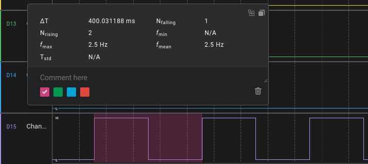
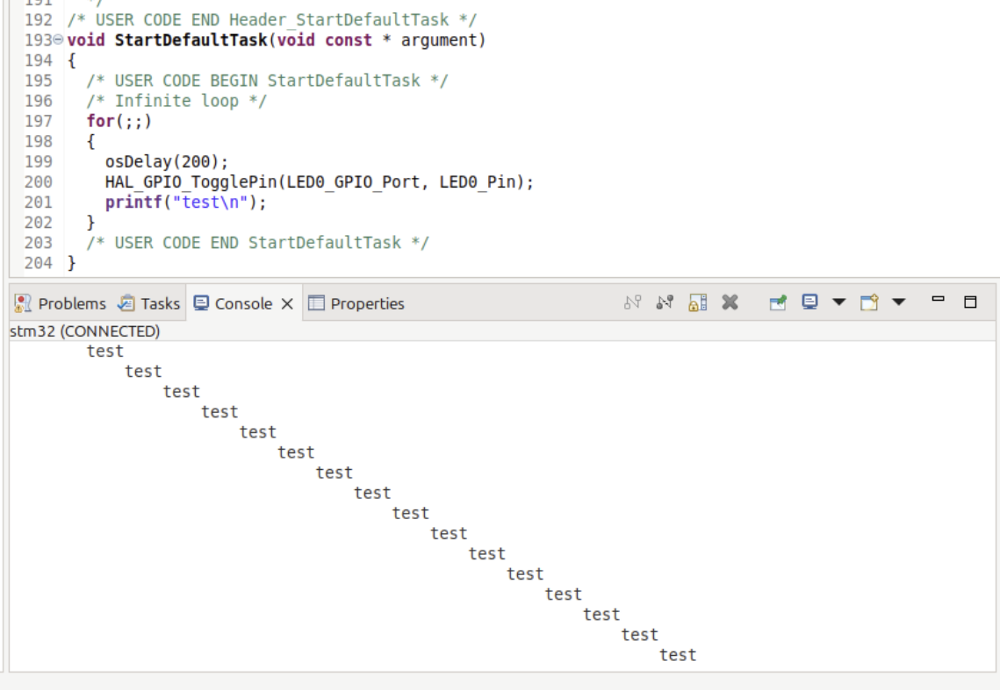

# Projekt FreeRTOS - STM32 Nucleo-64

Zadanie dotyczyło zapoznania się z podstawową konfiguracją systemu czasu rzeczywistego FreeRTOS na mikrokontrolerze STM32 z wykorzystaniem 4 zadań (wątków) oraz obsługi przerwań.

## 1. Konfiguracja (CubeIDE)
* **Płytka:** Nucleo-64.
* **System Core -> SYS:** Zmiana *Timebase Source* na TIM14, aby zwolnić SysTick dla FreeRTOS.
* **GPIO:** * Zmiana nazwy pinu diody z `LD2` na `LED0`.
    * Konfiguracja 3 dodatkowych pinów jako wyjścia (LED1, LED2, LED3) dla analizatora stanów logicznych.
    * Konfiguracja przycisku `B1` (blue button) jako źródło przerwania zewnętrznego (EXTI).

## 2. Implementacja Obsługi printf
W pliku `main.c` dodano definicję funkcji przekierowującej strumień na UART i przetestowano:

